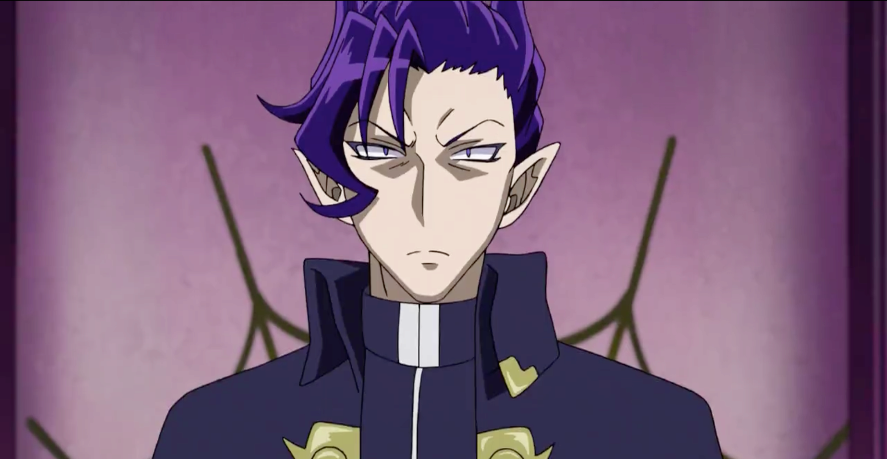

# MISC

## 💤Piquero (solved)

-   Score: 100, Solves: 347

### Problem


### Solution

The flag was encoded using ***Braille***.

1.  Find a [Braille decoder](https://www.dcode.fr/braille-alphabet) online to solve the problem.

    

2.  Type down the Braille ciphertext and get `⠠A⠠I⠠S3⠐⠸⠠I-FEEL-SLEEPY-⠠GOOD-⠠NIGHT!!!⠐⠸`.

3.  As the flag format, `AIS3{...}` are given, adjust the result.

    -   ignore all the `⠐ and ⠠`
    -   change `⠸` to `{ or }` and `-` to `_`

**FLAG:** `AIS3{I_feel_sleepy_Good_Night!!!}`


## 🐥Karuego (unsolved)

-   Score: 100, Solves: 245

### problem



### Solution

1.  Check the filetype of the image.

    

    ➜ correspond to the extension

2.  `binwalk` to check for any file within the image and extract them using `dd`.

    ```shell
    ➜ binwalk Karuego_0d9f4a9262326e0150272debfd4418aaa600ffe4.png
    DECIMAL       HEXADECIMAL     DESCRIPTION
    --------------------------------------------------------------------------------
    0             0x0             PNG image, 2880 x 1492, 8-bit/color RGBA, non-interlaced
    41            0x29            Zlib compressed data, compressed
    2059568       0x1F6D30        Zip archive data, at least v1.0 to extract, name: files/
    2059632       0x1F6D70        Zip archive data, encrypted at least v2.0 to extract, compressed size: 113020, uncompressed size: 113110, name: files/3a66fa5887bcb740438f1fb49f78569cb56e9233_hq.jpg
    2172779       0x21276B        Zip archive data, encrypted at least v2.0 to extract, compressed size: 1087747, uncompressed size: 1092860, name: files/Demon.png
    3260899       0x31C1E3        End of Zip archive, footer length: 22
    
    ➜ dd if=Karuego.png of=files.zip skip=2059568 bs=1
    1201353+0 records in
    1201353+0 records out
    1201353 bytes transferred in 6.364284 secs (188765 bytes/sec)
    ```

    -   The content of *png* file end at **2059568** and hide a zip folder after it.
    -   Try to unzip *file.zip* and ***find out the all the files <span style="color: red">need password to unzip and get stuck</span>.***

    ---

3.  Use `zsteg` to detect stegano-hidden data in PNG & BMP.

    ```shell
    ➜ zsteg -a karuego/Karuego.png | grep key
    b1,rgb,lsb,xy       .. text: "The key is : lafire"
    ```

    -   `lafire` should be the password to unzip

4.  `unzip` the file using password `lafire`

    ```shell
    ➜ unzip files.zip
    Archive:  files.zip
       creating: files/
    [files.zip] files/3a66fa5887bcb740438f1fb49f78569cb56e9233_hq.jpg password: 
      inflating: files/3a66fa5887bcb740438f1fb49f78569cb56e9233_hq.jpg  
      inflating: files/Demon.png 
    ```

5.  Get image *Demon.png* and find the **flag**.

    

---

##### Alternative (Cont. from step 2)

###### ATL 1

`fcrackzip, John the Ripper, or other tools` to brute force the password to unzip.

(This might take a while to get the key.)

###### ALT 2

From step 2, we can find that there is another image, `3a66fa5887bcb740438f1fb49f78569cb56e9233_hq.jpg`, in the zip file. Directly download the image and use *known-plaintext attack* with tool, `pkcrack`.

1.  Download image `3a66fa5887bcb740438f1fb49f78569cb56e9233_hq.jpg`.

    

2.  Create a directory `files` and put the image inside.

3.  Zip the folder `files` as `plain.zip`

    `zip -r files plain.zip`

4.  Use `pkcrack` for *known-plaintext attack*

    `pkcrack -C files.zip -c files/3a66fa5887bcb740438f1fb49f78569cb56e9233_hq.jpg -P plain.zip -p files/3a66fa5887bcb740438f1fb49f78569cb56e9233_hq.jpg -d crack.zip`

    

    ```shell
    ➜ pkcrack 
    Usage: pkcrack -c <crypted_file> -p <plaintext_file> [other_options],
    where [other_options] may be one or more of
     -o <offset>	for an offset of the plaintext into the ciphertext, (may be negative)
     -C <c-ZIP>	where c-ZIP is a ZIP-archive containing <crypted_file>
     -P <p-ZIP>	where p-ZIP is a ZIP-archive containing <plaintext_file>
     -d <d-file>	where d-file is the name of the decrypted archive which
    		will be created by this program if the correct keys are found
    		(can only be used in conjunction with the -C option)
     -i	switch off case-insensitive filename matching in ZIP-archives
     -a	abort keys searching after first success
     -n	no progress indicator
    ```

5.  Unzip *crack.zip* to find *Demon.png* and **flag


## 🌱Soy (solved)

-   Score: 139, Solves: 172


### Problem


### Solution

**Target**: recover the QR code


Recover the QR code with the help of the [webpage](https://merricx.github.io/).

1.  Choose the version that fit the given QR code.

    

2.  Fill the as much pixel in black and whie as possible.

    

3.  Use **Tools**, *Extract QR Information*, then the it can decode the hidden information in the QR code and find the flag.

**FLAG:** `AIS3{H0w_c4n_y0u_f1nd_me?!?!?!!}`


## 👑Saburo (solved)

-   Score: 359, Solves: 108

### Solution

*Timing Attack~~*

```
Flag: A
Haha, you lose in 20 milliseconds.
```

After `nc` to the problem, we can it will return the time taken, shown as the above, to verify the flag one character by one. While the input matches the true flag, it’ll take longer to verify. Therefore, implement *timing attack* to guess the flag one character by one character.


#### Notes

Though it is obvious that timing attack can achieve the flag, there is one difficulty in the problem, **the time of verifing is floating** and its range gets wider after the characters required to verify are longer. Therefore, whenever all posible characters of the next position show no improvement for three time, it’ll return to the previous character and start checking all possibe characters again.


### 👿Shichirou (unsolved)

-   Score: 450, Solves: 65

### 🧸Clara (unsolved)

-   Score: 500, Solves: 2